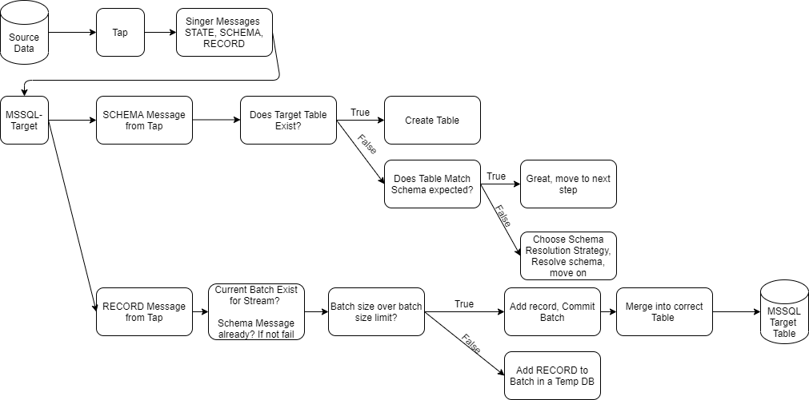

# Diagram

Diagrams Link https://drive.google.com/file/d/1FPDIOC4udfPfocEYUrAgC0cteTzlzzgD/view?usp=sharing

# Architecture
From a high level we need to parse SCHEMA, RECORD, and STATE messages (there's others as well but let's just focus on this for now.)

1. SCHEMA messages should look in the corresponding MSSQL table and see if the table already matches that schema provided. If not choose a resolution strategy, execute it, and move on
1. RECORD messages need to have a corresponding SCHEMA message before parsing. After words these messages should be batched into a TEMP table and then MERGED into the source data. 

Other high level things to think about
1. Threading, should you run with more than one thread?
1. Meta data following Sitch Datas lead here https://www.stitchdata.com/docs/replication/loading/understanding-destination-schemas
1. How to handle JSON data? Today just send the JSON data into a NVARCHAR(MAX)

